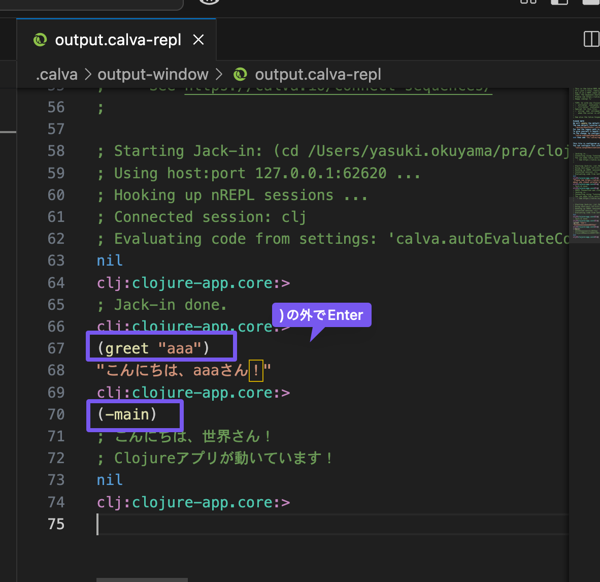

## このディレクトリの作成コマンド
```
lein new app clojure-app
```

## 実行
### 1. ターミナルから実行
```
lein run 
```

### 2. CalvaのREPLを使用
1. `Cmd+Shift+P` でコマンドパレットを開く
2. "Calva: Start a Project REPL and Connect" を選択
3. プロジェクトタイプで "Leiningen" を選択
4. 立ち上がったところで関数を実行する。
